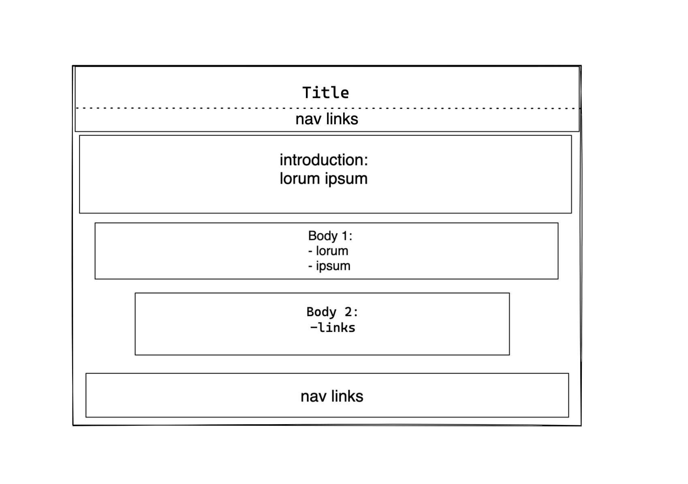

# Design

<!-- give an overview of your project's design -->
<!-- describe the reasoning behind your group's design and wireframe -->
<!-- include other centralized decisions like fonts, palates, ... -->

- In this project the webpage 'All about trees` is replicated.
- We decided not to change the given template.
- Title: Times New Roman in **Bold**
- Introduction: _Italic_ font
- Body 1: Times New Roman with added ~~strikethrough~~
- Body 2: Links added
- Navigation bar: Social links added

---

## Wireframe(s)

<!-- provide a link to your wireframe documenting on Figma, or wherever it is -->

